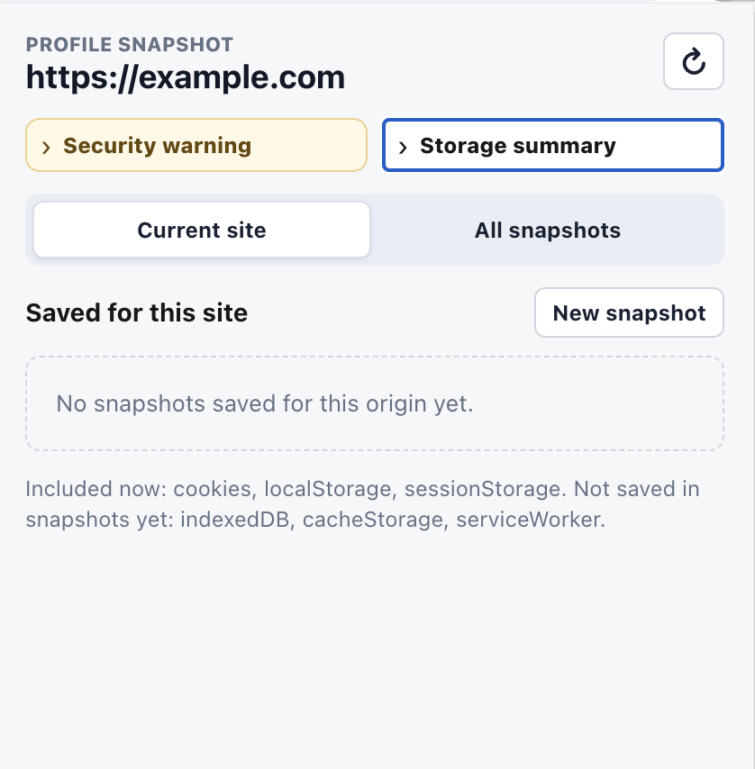

# Profile Snapshot Browser Extension

Profile Snapshot 是一個給 QA、dev 測試使用的 browser extension。它可以針對目前網站建立瀏覽器狀態快照，之後快速切換不同登入身份、測試 profile 或站台狀態。

> Snapshot 可能包含 session cookie、access token、client secret 或其他敏感資料。請只在本機開發與測試環境使用，不要分享匯出的 snapshot 檔案。

## 功能



- 針對目前 `http` / `https` 網站建立 Profile Snapshot。
- 依照 origin 分組保存，例如 `https://example.com`、`http://localhost:3000`。
- 顯示目前網站已保存的 snapshot 清單。
- 顯示所有網站 snapshot 的總覽與總使用空間。
- 顯示每個 snapshot 的名稱、建立時間、大小與包含的 storage 類型。
- 套用 snapshot 前會先清除目前網站狀態，再還原 snapshot 並 reload tab。
- 刪除單一 snapshot。
- 刪除所有 snapshot。
- 清除目前網站的 browser state，不會刪除 extension 裡保存的 snapshot。
- 匯出單一 snapshot，匯出前會顯示敏感資料警告。

## 目前保存的資料

每個 snapshot 目前會保存：

- Cookies，包含 HttpOnly cookie 與主要 metadata。
- `localStorage`
- `sessionStorage`

清除目前網站狀態時，會 best-effort 清除：

- Cookies
- `localStorage`
- `sessionStorage`
- IndexedDB
- Cache Storage
- Service Worker registrations

目前 snapshot 尚未保存 IndexedDB、Cache Storage、Service Worker registrations。Popup UI 會標示這些項目尚未包含在 snapshot 中。

## Snapshot 存放位置

Snapshot 存在 extension 的本機 storage：

```ts
browser.storage.local
```

每個 snapshot 都是獨立 record，key 格式為：

```txt
profileSnapshot:<snapshotId>
```

例如：

```txt
profileSnapshot:snapshot_2026-06-27T10-30-00.000Z
```

這個專案不使用 `chrome.storage.sync` / `browser.storage.sync`，因此 snapshot 不會透過瀏覽器同步到雲端。資料會跟著目前 browser profile 與 extension installation 留在本機。

## 權限

Extension manifest 需要以下權限：

- `cookies`
- `storage`
- `tabs`
- `activeTab`
- `scripting`
- `host_permissions: ["<all_urls>"]`

需要 `<all_urls>` 是因為 extension 必須能在任意普通網站讀取與還原該 origin 的 cookies、`localStorage`、`sessionStorage`。

## 開發

安裝依賴：

```bash
yarn install
```

啟動開發模式：

```bash
yarn dev
```

型別檢查：

```bash
yarn compile
```

建立 Chrome MV3 extension：

```bash
yarn build
```

建立 Firefox extension：

```bash
yarn build:firefox
```

打包：

```bash
yarn zip
```

## GitHub Actions 打包

專案提供 `Build extension` workflow，可以在 GitHub 上手動選擇瀏覽器 target 並產生 extension zip。

1. 到 repository 的 Actions 頁面。
2. 選擇 `Build extension` workflow。
3. 點擊 `Run workflow`。
4. 在 `Browser target` 選擇要打包的瀏覽器：
   - `chrome`
   - `firefox`
   - `edge`
5. 等 workflow 完成後，到該次 run 的 Artifacts 下載 `profile-snapshot-<browser>`。

Workflow 會依序執行：

```bash
yarn install --frozen-lockfile
yarn compile
yarn wxt zip -b <browser>
```

產出的 zip 會來自 `.output/*-<browser>.zip`。Firefox build 目前可能會顯示 WXT 對 `data_collection_permissions` 與 extension ID 的提示，這是發佈到 Firefox Add-ons 前需要補齊的 metadata 提醒，不會阻止本專案打包。

## 在 Chrome / Edge 載入

1. 執行 `yarn build`。
2. 開啟瀏覽器的 extensions 管理頁。
3. 啟用 Developer mode。
4. 選擇 Load unpacked。
5. 載入 `.output/chrome-mv3`。

## 使用方式

1. 開啟任一普通 `http` / `https` 網站。
2. 點擊 Profile Snapshot extension icon。
3. 在 popup 輸入 snapshot 名稱，或留空使用預設名稱。
4. 點擊 Create 建立 snapshot。
5. 之後可在同一個 origin 使用 Apply 還原該 snapshot。

套用 snapshot 會覆蓋目前網站的 cookies、`localStorage`、`sessionStorage`，並 reload 目前 tab。刪除 snapshot 只會刪除 extension 內保存的資料，不會影響目前網站正在使用中的 browser state。

## 專案結構

```txt
entrypoints/background.ts     Background message API 與 snapshot 核心邏輯
entrypoints/popup/App.vue     Popup 管理介面
entrypoints/popup/style.css   Popup 樣式
utils/snapshots.ts            Snapshot 型別、格式化與 storage key 工具
wxt.config.ts                 WXT 設定與 manifest 權限
```

## 安全提醒

- Snapshot 可能包含有效登入 session。
- 匯出的 JSON 不應提交到 git、貼到 issue、傳給他人或上傳到共享空間。
- 若測試完成，建議使用 Delete all 清除 extension 內保存的 snapshot。
- 套用 snapshot 後仍可能因 session 過期而被網站導回登入頁，這是預期限制。
